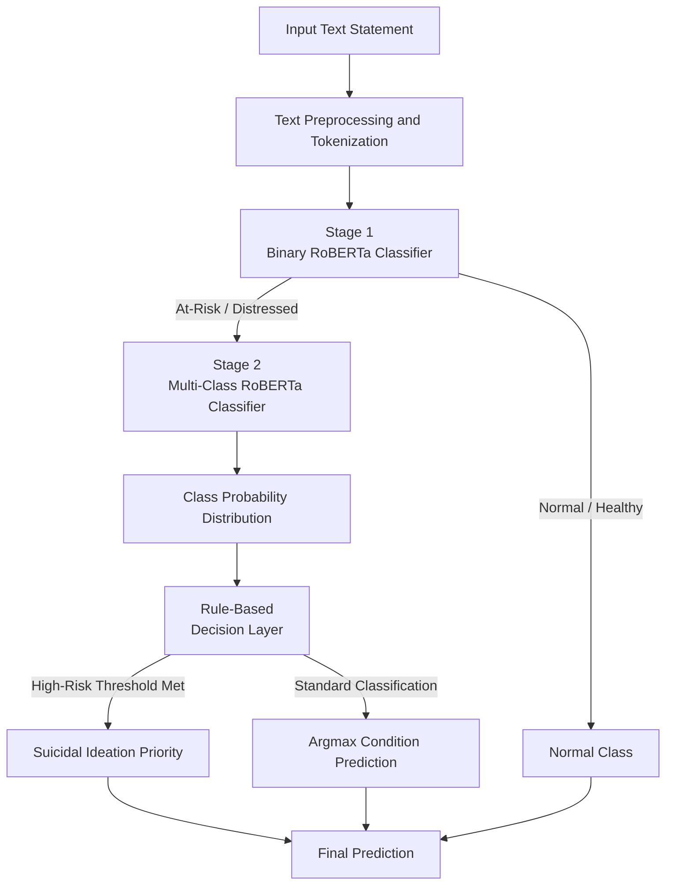

# Hierarchical Risk-Aware Mental-RoBERTa

A hierarchical transformer-based framework for multi-class mental health text classification and risk-aware screening research.

---

## Introduction

Mental health text classification plays a critical role in early risk detection and computational linguistic screening. Standard flat classification models often face challenges with class imbalance, lexical overlap between comorbid mental health conditions, and varying degrees of severity between benign and high-risk expressions.

This repository provides the reference implementation of the **Hierarchical Risk-Aware Mental-RoBERTa (HRA-Mental-RoBERTa)** framework. The architecture decomposes multi-class mental health assessment into a structured, two-stage hierarchical pipeline followed by a risk-aware post-processing layer:

1. **Stage 1 (Binary Screening):** Differentiates benign statements (`Normal`) from individuals experiencing distress (`At-Risk`).
2. **Stage 2 (Multi-Class Fine-Grained Categorization):** Routes distressed instances to a specialized multi-class classifier to identify specific conditions: Depression, Suicidal Ideation, Anxiety, Stress, Bipolar Disorder, and Personality Disorder.
3. **Decision Layer:** Applies rule-based inference thresholding to ensure critical indicators (such as high-risk suicidal expressions) are consistently prioritized during clinical screening.

---

## Research Context

This repository contains the codebase and experimental workflows associated with the research study:

> **Hierarchical Risk-Aware Mental-RoBERTa Framework for Early Multi-Class Screening of Mental-Health Conditions and Suicidal Ideation, 2026**

### Authors
- **Ayush Raj**
- **Abhinav Srivastava**
- **Dr. Kamnta Nath Mishra**
- **Dr. Alok Mishra**

---

## Overview

The framework adopts a two-stage strategy designed to separate the broad detection of distress from the fine-grained categorization of specific disorders:

- **Stage 1 (Binary Screening):** Identifies whether an incoming text represents a baseline `Normal` state or indicates an `At-Risk` condition. Filtering out healthy instances at the first tier reduces spurious misclassifications across non-distressed text.
- **Stage 2 (Multi-Class Classification):** Focuses model capacity specifically on distinguishing among distressed categories: *Depression*, *Suicidal*, *Anxiety*, *Stress*, *Bipolar*, and *Personality Disorder*.
- **Decision Layer (Rule-Based Post-Processing):** Incorporates safety-focused inference logic (`stage2_decision`) where high-consequence classes (such as suicidal ideation) can be prioritized when predicted probability exceeds a tuned sensitivity threshold.

---

## System Architecture



---

## Dataset

Experiments utilize the benchmark *Sentiment Analysis for Mental Health* dataset (Suchintika Sarkar, Kaggle), compiling over 52,000 labeled textual statements from 9 publicly available sources (such as Reddit mental health subreddits, suicidal tweet corpora, and conversational datasets).

### Target Classes (7 Categories)
- **Normal** (Baseline healthy state)
- **Depression**
- **Suicidal**
- **Anxiety**
- **Stress**
- **Bipolar**
- **Personality Disorder**

### Attributes
- `unique_id`: Unique sample identifier
- `text` (`statement`): Textual statement or social media post
- `label` (`status`): Ground-truth mental health classification

Detailed schema descriptions, sub-source breakdowns, and citations are documented in [`data/data.md`](data/data.md).

---

## Methodology & Training

The architecture is implemented in PyTorch using Hugging Face Transformers:

1. **Backbone Model:** Domain-adapted `mental/mental-roberta-base` (with comparison against standard `roberta-base`).
2. **Stage 1 Training:** Fine-tuned on the full dataset with binary targets (`0: Normal`, `1: Distressed`) using Cross-Entropy loss and AdamW optimizer.
3. **Stage 2 Training:** Fine-tuned specifically on the distressed subset using `SmoothedWeightedTrainer`. This incorporates:
   - Inverse class frequency weighting to handle class imbalance across rare conditions.
   - Label smoothing (0.1) to avoid overconfident output distributions.
4. **Inference Thresholding:** Configurable decision rules to optimize sensitivity for critical risk indicators.

---

## Evaluation & Statistical Validation

The repository includes comprehensive validation protocols in [`notebook/main.ipynb`](notebook/main.ipynb):

- **Performance Metrics:** Precision, Recall, Macro F1-Score, Overall System Accuracy, and Stage 2 Top-2 Accuracy.
- **Error Analysis:** Stage 1, Stage 2, and end-to-end confusion matrices.
- **Statistical Rigor:** 95% Bootstrapped Confidence Intervals (1,000 iterations) for key classification metrics.
- **Baseline Comparison:** Direct benchmarking against flat multi-class RoBERTa baselines.
- **Generalization Gap:** Evaluation of training vs. validation performance gaps across epochs.

---

## Repository Structure

```
HRA-Mental-Roberta-2026/
├── .gitattributes          # Git LFS configuration (*.safetensors)
├── .gitignore              # Project hygiene and environment ignore rules
├── requirements.txt        # Research dependencies and environment specifications
├── readme.md               # Framework documentation and technical overview
├── data/
│   └── data.md             # Benchmark dataset documentation and citations
├── models/
│   └── readthis.md         # External checkpoint hosting and storage link
└── notebook/
    └── main.ipynb          # Full research notebook (pipeline, training, evaluation)
```

---

## Installation & Setup

### Prerequisites
- Python 3.10+
- CUDA-enabled GPU (recommended for training and inference)

### Environment Setup
```bash
# Clone the repository
git clone https://github.com/ayushrajcodes0407/HRA-Mental-Roberta-2026.git
cd HRA-Mental-Roberta-2026

# Create virtual environment
python -m venv .venv
source .venv/bin/activate  # On Windows: .venv\Scripts\activate

# Install dependencies
pip install -r requirements.txt
```

---

## Reproducibility & Execution

1. Open [`notebook/main.ipynb`](notebook/main.ipynb) in Jupyter Lab, VS Code, or Google Colab.
2. Run notebook cells sequentially:
   - **Section 1–2:** Setup environment, download Kaggle dataset via `kagglehub`, and preprocess data.
   - **Section 3:** Train and evaluate Stage 1 binary classifier.
   - **Section 4:** Filter distressed data and train Stage 2 multi-class classifier.
   - **Section 5–7:** Evaluate system metrics, compute bootstrapped confidence intervals, and benchmark against flat classification.
3. Pretrained model checkpoints and training artifacts are linked in [`models/readthis.md`](models/readthis.md).

---

## Citation

If you use this codebase or research framework, please cite:

```bibtex
@article{raj2026hramentalroberta,
  title={Hierarchical Risk-Aware Mental-RoBERTa Framework for Early Multi-Class Screening of Mental-Health Conditions and Suicidal Ideation},
  author={Raj, Ayush and Srivastava, Abhinav and Mishra, Kamnta Nath and Mishra, Alok},
  year={2026}
}
```

Please also cite the underlying benchmark dataset as referenced in [`data/data.md`](data/data.md).
